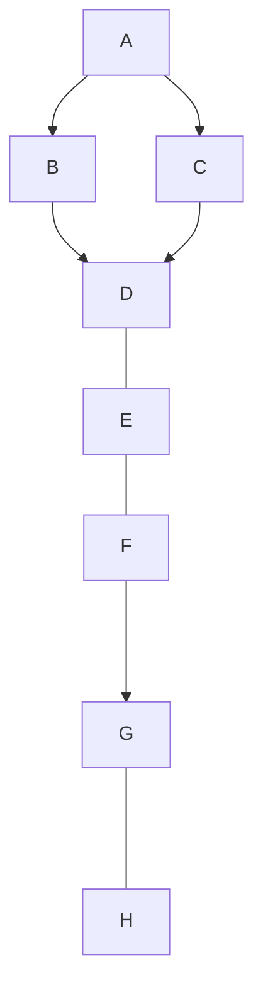
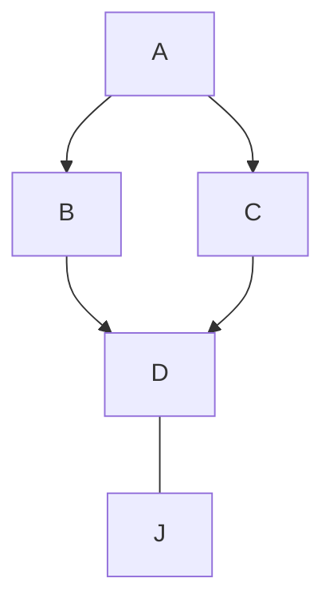

```mermaid
  graph TB;
      A-->B;
      A-->C;
      B-->D;
      C-->D;
      D---E;
      E---F;
      F--->G;
      G----H;
```

Какая-то диаграмма, например

Тут вот ещё одна диаграмма:

```mermaid
  graph TD;
      A-->B;
      A-->C;
      B-->D;
      C-->D;
      D---J;
```
